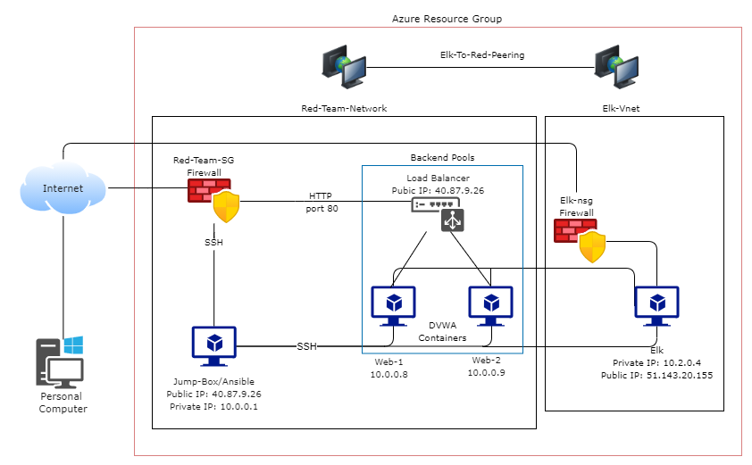
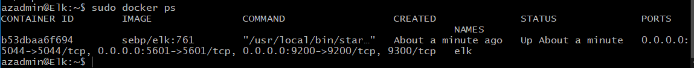

# Elk-Stack-Project
## Automated ELK Stack Deployment

The files in this repository were used to configure the network depicted below.

These files have been tested and used to generate a live ELK deployment on Azure. They can be used to either recreate the entire deployment pictured above. Alternatively, select portions of the install-elk.yml file may be used to install only certain pieces of it, such as Filebeat.

  - install-elk.yml

This document contains the following details:
- Description of the Topology
- Access Policies
- ELK Configuration
  - Beats in Use
  - Machines Being Monitored
- How to Use the Ansible Build

### Description of the Topology

The main purpose of this network is to expose a load-balanced and monitored instance of DVWA, the D*mn Vulnerable Web Application.

Load balancing ensures that the application will be highly available, in addition to restricting access to the network.
- -What aspect of security do load balancers protect?
     --Load balancers aid in preventing DDOS attacks.  Load balancers require valid HTTP to pass onto the server. DDOS attacks are usually at the TCP level and they are usually invalid data, so if the load balancer gets invalid data it'll send back an error.  If the DDOS attack has valid HTTP it's going to load balance it between the servers mitigating the risk of getting overloaded.  If the functionality is built in the LB could possible circuit break if it knows that a service is overloaded, preventing anymore requests going to a server until the server says it's available again. 

  -What is the advantage of a jump box?
     --A jump box provides separation between two networks and controls access to the remote network. Acting as the single entry point to bridge two networks it also logs all access requests which can also be monitored for malicious activity.
  

Integrating an ELK server allows users to easily monitor the vulnerable VMs for changes to the event logs and system metrics.
-Filebeat collects and centralizes logs and files, which can then be used for analytics and devOps monitoring.
-Metricbeats records system and service statistics which can then be used to monitor performance.

The configuration details of each machine may be found below.

| Name     | Function   | IP Address | Operating System |
|----------|------------|------------|------------------|
| Jump-Box | Gateway    | 10.0.0.4   | Ubuntu 18.04     |
| Web-1    | Web Server | 10.0.0.5   | Ubuntu 18.04     |
| Web-2    | Web Server | 10.0.0.6   | Ubuntu 18.04     |
| Elk      | Log Server | 10.2.0.4   | Ubuntu 18.04     |

### Access Policies

The machines on the internal network are not exposed to the public Internet. 

Only the load balancer machine can accept connections from the Internet. Access to this machine is only allowed from the following IP addresses: 
- Whitelisted IP: Personal IP

Machines within the network can only be accessed by the jump-box-provisioner.
- It can be accessed via the web browser from my personal IP through 5601, it can also be accessed through the jump-box-provisioner. 

A summary of the access policies in place can be found in the table below.

| Name          | Publicly Accessible | Allowed IP Address          |
|---------------|---------------------|-----------------------------|
| Load Balancer | Yes                 | Personal                    |
| Jump-Box      | Yes                 | Personal                    |
| Web-1         | No                  | 10.0.0.4                    |
| Web-2         | No                  | 10.0.0.4                    |
| Elk           | Yes                 | 10.0.0.4,10.0.0.5, 10.0.0.6 |

### Elk Configuration

Ansible was used to automate configuration of the ELK machine. No configuration was performed manually, which is advantageous because...
- _TODO: What is the main advantage of automating configuration with Ansible?_

The playbook implements the following tasks:
- _TODO: In 3-5 bullets, explain the steps of the ELK installation play. E.g., install Docker; download image; etc._
- Install dockio.io
- Install python3-pip and enables its docker module
- Increases its virtual memory
- Starts elk docker on reboot

The following screenshot displays the result of running `docker ps` after successfully configuring the ELK instance.

### Target Machines & Beats
This ELK server is configured to monitor the following machines:
- Web-1 10.0.0.5
  Web-2 10.0.0.6

We have installed the following Beats on these machines:
- Filebeat
  Metricbeat

These Beats allow us to collect the following information from each machine:
- Filebeat: Collects log files.
  Metricbeat: Collects system and service analytics.

### Using the Playbook
In order to use the playbook, you will need to have an Ansible control node already configured. Assuming you have such a control node provisioned: 

SSH into the control node and follow the steps below:
- Copy the install-elk.yml file to /etc/ansible/ directory.
  
- Update the install-elk.yml file to include the IP's of the VM's .
- Run the playbook, and navigate to http://<elk-IP>:5601/app/kibana to check that the installation worked as expected.

_TODO: Answer the following questions to fill in the blanks:_
- _Which file is the playbook? Where do you copy it?_
- _Which file do you update to make Ansible run the playbook on a specific machine? How do I specify which machine to install the ELK server on versus which to install Filebeat on?_
- _Which URL do you navigate to in order to check that the ELK server is running?
   --http://<elk-IP>:5601/app/kibana

_As a **Bonus**, provide the specific commands the user will need to run to download the playbook, update the files, etc._

curl https://gist.githubusercontent.com/slape/5cc350109583af6cbe577bbcc0710c93/raw/eca603b72586fbe148c11f9c87bf96a63cb25760/Filebeat > /etc/ansible/filebeat‐config.yml

